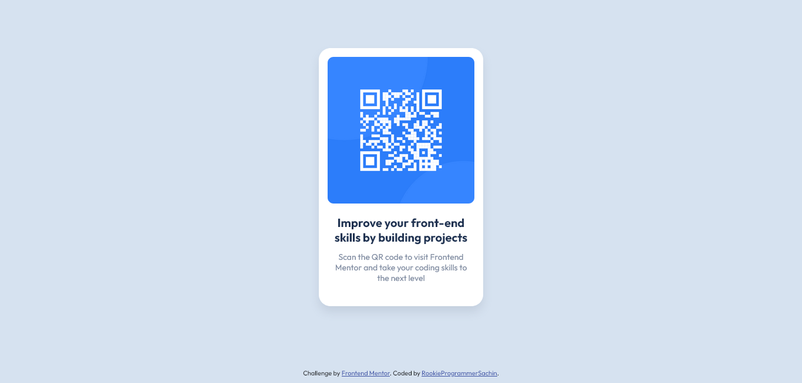

# Frontend Mentor - QR code component solution

This is a solution to the [QR code component challenge on Frontend Mentor](https://www.frontendmentor.io/challenges/qr-code-component-iux_sIO_H). Frontend Mentor challenges help you improve your coding skills by building realistic projects. 

## Table of contents

- [Overview](#overview)
  - [Screenshot](#screenshot)
  - [Links](#links)
- [My process](#my-process)
  - [Built with](#built-with)
  - [What I learned](#what-i-learned)
  - [Continued development](#continued-development)
- [Author](#author)

### Overview
--------------------------------------------------------------------------------------------------

### Screenshot

### Links

- Solution URL: [https://rookieprogrammersachin.github.io/FrontendMentor-QRCodeComponent/](https://rookieprogrammersachin.github.io/FrontendMentor-QRCodeComponent/)
- Live Site URL: [https://rookieprogrammersachin.github.io/FrontendMentor-QRCodeComponent/](https://rookieprogrammersachin.github.io/FrontendMentor-QRCodeComponent/)

## My process
---------------------------------------------------------------------------------------------------

### Built with

- Semantic HTML5 markup
- CSS custom properties
- Flexbox

### What I learned

Learnt how to eyeball the design provided and recreate it exactly as needed. Learnt how to center a div horizontally and vertically. 

### Continued development

I still wish to learn more about making webpages responsive with media queries and some JS. 

## Author

- Website - [RookieProgrammerSachin](https://github.com/RookieProgrammerSachin/)
- Frontend Mentor - [@RookieProgrammerSachin](https://www.frontendmentor.io/profile/RookieProgrammerSachin)

